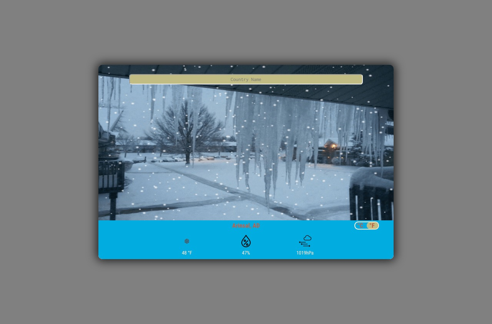
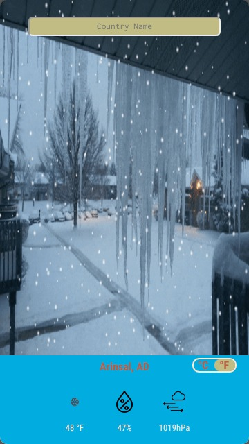

# Weather App
> Weather app is a web app that enables the user to get weather related info about any city in the world.

[![NPM Version][npm-image]][npm-url]
[![Build Status][travis-image]][travis-url]
[![Downloads Stats][npm-downloads]][npm-url]

The app interrogates the user for the exact city that she/he want to know its current weather conditions. Subsequently, it gathers weather related info (e.g. temperature, pressure and humidity) from reliable sources (i.e. OpenWeatherMap) and adjust its looks accordingly.

<div style="text-align: center;">
  <h2 style="color: pink;">Web View</h2>
  
  <h2 style="color: pink;">Mobile View</h2>
  
</div>

## Technologies used

In this app we used the following technologies:
  - Html & SCSS
  - Javascript (Promises & async functions)
  - Webpack
  - APIs (OpenWeather & Giphy)

* This design of this project is an assignment that falls under the microverse curriculium:
  - [link to the assignment](https://www.theodinproject.com/courses/javascript/lessons/weather-app)

### Live preview
- Check out a live version of the page [live](https://rawcdn.githack.com/stratospherique/Weather-App-JS/ef39618fc7a24fe22c79bb20a182d1814fc264c8/index.html)


## Installation

- The app uses Webpack bundler. Npm package manager should be installed

## Development setup

- The app is available online. However, if you like to start it on local environment, type the following instructions:

```sh
npm install
npm start
```

- To test some of the app's feature Using **Jest**, type the following instructions: 

```sh
npm test
```

## Meta

Ahmed Mahfoudh – [@AhmedMahfoudh8](https://twitter.com/AhmedMahfoudh8) – ahmed.mahfoudh1991@gmail.com

Distributed under the XYZ license. See ``LICENSE`` for more information.

[https://github.com/yourname/github-link](https://github.com/dbader/)

## Contributing

1. Fork it 
2. Create your feature branch 
3. Commit your changes 
4. Push to the branch 
5. Create a new Pull Request

<!-- Markdown link & img dfn's -->
[npm-image]: https://img.shields.io/npm/v/datadog-metrics.svg?style=flat-square
[npm-url]: https://npmjs.org/package/datadog-metrics
[npm-downloads]: https://img.shields.io/npm/dm/datadog-metrics.svg?style=flat-square
[travis-image]: https://img.shields.io/travis/dbader/node-datadog-metrics/master.svg?style=flat-square
[travis-url]: https://travis-ci.org/dbader/node-datadog-metrics
[wiki]: https://github.com/yourname/yourproject/wiki